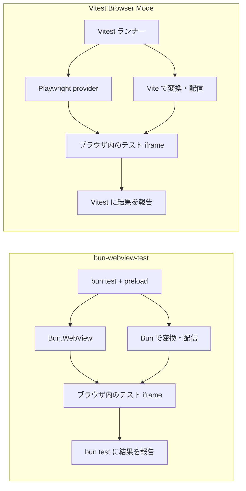

# bun-webview-test

[English](./README.md)

**`bun test` でブラウザのテストを書くためのモジュールです。** [`Bun.WebView`](https://bun.com/docs) を通じて `bun test` から本物のブラウザ（既定は Chrome Headless Shell）を起動し、[Vitest Browser Mode](https://vitest.dev/guide/browser/)と同じ形の
ロケーター、`userEvent`、`expect.element` で操作します。Playwright も別のテストランナーも要りません。Vitest互換APIでは、対応する既存テストをブラウザ内で実行できます。

> [!NOTE]
> 非公式のモジュールで、Bun（Oven）とは関係ありません。詳しくは[このモジュールについて](#このモジュールについて)を見てください。

> [!WARNING]
> `Bun.WebView` は Bun 1.3.14 時点で experimental で、このモジュールも同じく実験的です。1.0 までは破壊的な変更が入ることがあります。

[クイックスタート](#クイックスタート) · [Vitestとの比較](#vitest-browser-mode-との比較) · [ブラウザの準備](#必要なもの) · [ネイティブAPI](#ネイティブapi) · [Vitest互換API](#vitest-のブラウザモードのテストをそのまま動かす) · [CI](#ci-で動かす)

## クイックスタート

Bun **1.3.14** 以降と Chrome Headless Shell が必要です（[必要なもの](#必要なもの)）。
ここではネイティブAPIを使います。`vitest` をimportする既存テストは、[Vitest互換APIの手順](#vitest-のブラウザモードのテストをそのまま動かす)を参照してください。

1. インストールします。

   ```sh
   bun add -d bun-webview-test
   bunx bun-webview-test install
   ```

2. `bunfig.toml` に preload を足します。

   ```toml
   [test]
   preload = ["bun-webview-test/preload"]
   ```

3. 表示するものと、そのテストを書きます。

   ```ts
   // src/counter.ts
   export default (root: HTMLElement, { initial }: { initial: number }) => {
     let count = initial;
     root.innerHTML = `<button>Increment</button><p role="status">count: ${count}</p>`;
     root.querySelector("button")!.addEventListener("click", () => {
       root.querySelector("[role=status]")!.textContent = `count: ${++count}`;
     });
   };
   ```

   ```ts
   // src/counter.test.ts
   import { expect, test } from "bun:test";
   import { page, userEvent } from "bun-webview-test";

   test("カウンター", async () => {
     await page.mount(new URL("./counter.ts", import.meta.url), { initial: 0 });

     await userEvent.click(page.getByRole("button", { name: "Increment" }));

     await expect.element(page.getByRole("status")).toHaveTextContent("count: 1");
   });
   ```

4. 実行します。

   ```sh
   bun test
   ```

## Vitest Browser Mode との比較

比較対象は `@vitest/browser-playwright` と Chromium を使う Vitest です。他の provider やブラウザでは構成が異なります。

| 観点 | bun-webview-test | Vitest Browser Mode / Playwright |
| --- | --- | --- |
| テストランナー | `bun test`。結果も Bun のランナーに集約 | Vitest。結果も Vitest のランナーに集約 |
| モジュールの変換・配信 | Bun のビルド API と `Bun.serve` による HTTP サーバー | Vite の開発サーバーとプラグインによる変換 |
| ブラウザ操作 | `Bun.WebView`。既定は Chrome Headless Shell | Playwright provider。Chromium では Headless Shell も利用可能 |
| ブラウザの取得 | 付属の `bun-webview-test install`。固定版 Shell のみ取得 | Playwright CLI。`--only-shell` で通常版 Chromium の取得を省略可能 |
| 連携 | Bun の実行環境と Vitest 互換 API。[対応していないもの](#対応していないもの)も参照 | Vite の設定・プラグインと、Playwright の Chromium・Firefox・WebKit 対応 |

比較対象の構成は、公式の [Vitest Browser Mode ガイド](https://vitest.dev/guide/browser/)と [Playwright のブラウザ導入ガイド](https://playwright.dev/docs/browsers)も参照してください。

### 速度

記録した **Linux CIでは9.49秒、Vitestは11.10秒で、実行時間が14.5%短縮**されました。
両方とも **同じ Chrome Headless Shell 145.0.7632.6 の実行ファイル**を使っています。

| Linux CI・Headless Shell | 実行時間の中央値 |
| --- | ---: |
| bun-webview-test | **9.49秒** |
| Vitest Browser Mode + Playwright | 11.10秒 |

Ubuntu 24.04 x64、Bun 1.4.2、Node 24.21.0、Vitest 5.0.3、Playwright 1.56.1、各2ワーカーで計測しました。
既存の5ファイルを20組複製した100ファイル・800テスト・スクリーンショット100回のワークロードです。
各ランナーをウォームアップ1回後に3回測定し、実行順を交代させています。起動から終了までを含み、依存パッケージやブラウザの導入時間は含みません。
bun-webview-test は `--parallel=2 --no-isolate` で実行しています。
異なる800ケースではなく、ファイル数を増やした場合の計測です。CIの負荷やテスト内容によって結果は変わります。

[GitHub Actionsの実行結果](https://github.com/ts020/bun-browser-test/actions/runs/37551576464) ·
[保存した計測値・実行環境](bench/vitest-browser/scaling-results-linux-ci-memory.json) ·
[再現手順](bench/vitest-browser/README.md#ci-benchmark)

<details>
<summary>macOSでの比較：Headless Shell・通常版Chrome・WKWebView</summary>

Apple M2 Pro、macOS 26.6.2、Bun 1.4.2、Node 26.3.0。同じワークロードを4ワーカー、ウォームアップ1回＋計測3回で測定しました。
Chromiumの各比較は、同じ145.0.7632.6の実行ファイルを使っています。

| ブラウザ | bun-webview-test | Vitest 5.0.3 / Playwright 1.56.1 |
| --- | ---: | ---: |
| Chrome Headless Shell | **3.93秒** | 5.35秒 |
| 通常版Chrome、ヘッドレス | **8.14秒** | 9.21秒 |
| WKWebView | 8.14秒 | — |

実行時間はShellで26.5%、通常版Chromeで11.6%短縮しました。実行環境とワーカー数が違うため、Linux CIの秒数とは直接比較できません。
[計測方法と生の値](bench/vitest-browser/README.md#file-count-scaling)を参照してください。

</details>

### 動作フロー

<details>
<summary>モジュール配信・ブラウザ操作・結果報告の流れ</summary>

既存の Vitest 形式のテストは、どちらも実際のブラウザ内で実行します。ホスト側のランナー、モジュール配信、ブラウザ操作を担当する仕組みが異なります。



図は処理の役割を示しており、箱の数が OS のプロセス数を表すわけではありません。Chromium 自体は複数プロセスを使います。
ネイティブの `bun-webview-test` API ではテスト関数は Bun 側で動き、`page` を通じてブラウザを操作します。上の図は Vitest 互換 API の流れです。
`--no-isolate` では条件を満たす Chrome のタブをワーカー内で再利用し、ファイルごとに document を作り直します。詳しくは[並列実行と分離](#並列実行と分離)を参照してください。

</details>

### ダウンロード容量と導入後の容量

macOS arm64 の独立したプロジェクトに Bun 1.4.2 で導入したところ、この作業版と依存パッケージの npm ファイルは **47.9 MB**、Vitest 5.0.3・`@vitest/browser-playwright` 5.0.3・Playwright 1.56.1 は **50.0 MB** でした。
`node_modules` 内のファイルサイズの合計で、シンボリックリンク・ブラウザ・ランタイム・パッケージマネージャーのキャッシュを除きます。圧縮された通信量やディスクの割当容量ではありません。この計測での差は小さめです。
本パッケージも `vitest`・`@vitest/browser` に依存し、Vite も間接的に導入されます。実行時に Vite の配信処理を使わないことと、npm 依存がなくなることは別です。[容量の計測値と方法](bench/vitest-browser/README.md#installation-size)を参照してください。

ブラウザの取得容量は別です。Chrome for Testing **145.0.7632.6** の公式 ZIP サイズ（十進 MB）は次のとおりです。

| プラットフォーム | Headless Shell | 通常版 Chrome |
| --- | ---: | ---: |
| macOS arm64 | 95.5 MB | 170.2 MB |
| Linux x64 | 116.3 MB | 175.4 MB |
| Windows x64 | 114.1 MB | 181.2 MB |

これはブラウザの配布物の比較です。同じ Shell の配布物を使えば、両ランナーでブラウザ本体の容量は同じです。
本パッケージの CLI は Shell のみを取得します。Playwright も [`--only-shell`](https://playwright.dev/docs/browsers#chromium-headless-shell) で通常版 Chromium の取得を省けるので、Shell と通常版 Chrome の容量差がそのまま Vitest に対する優位性になるわけではありません。
[正確なバイト数と取得元 URL](bench/vitest-browser/browser-download-sizes.json)も記録しています。ブラウザの展開後の容量はここでは未計測です。

### メモリ効率

同じLinux CIジョブで、同じワークロード・双方2ワーカーのまま別途メモリを計測した結果、
**674.3 MiB 対 Vitestの885.5 MiBで、ピークPSSが23.9%少ない**結果でした。

| ランナー | ピークPSSの中央値 |
| --- | ---: |
| bun-webview-test | **674.3 MiB** |
| Vitest Browser Mode + Playwright | 885.5 MiB |

ホスト側のランナー・ワーカー・サーバー・ブラウザを含め、共有メモリは利用割合に応じて数えています。
ウォームアップ1回後の3回について、目標50ms間隔で集計した各回のピークの中央値です。
速度計測とは別に実行するため、上の実行時間にはサンプリング負荷を含みません。短いピークは見逃す可能性があります。
[生の計測値と実行環境](bench/vitest-browser/scaling-results-linux-ci-memory.json)も保存しています。

macOS・WKWebViewの比較はメモリ未計測です。通常版Chromiumを使った過去の別ワークロードの値は、
[以前のLinux計測](bench/vitest-browser/README.md#earlier-linux-measurements)にまとめています。

## 必要なもの

- Bun **1.3.14** 以降（`Bun.WebView` を使います）
- **Chrome Headless Shell**: macOS・Linux・Windows 共通の既定です。
  インストーラーは固定版 **145.0.7632.6** を
  [Chrome for Testing](https://googlechromelabs.github.io/chrome-for-testing/) から取得します。
- 展開には macOS/Linux で `unzip`、Windows で PowerShell が必要です。Linux では Chromium のシステムライブラリ
  （NSS・X11・GBM・ALSA など）も必要です。OS パッケージは自動導入しません。
  固定版の対応先は macOS arm64/x64、Linux x64、Windows x64/x86 です。Linux arm64 では
  対応する新しい版を `BWT_BROWSER_VERSION` で指定するか、`BUN_CHROME_PATH` で対応ブラウザを指定してください。

両方のテスト API で `chrome` バックエンドから Shell を使い、処理負担と OS ごとのブラウザ選択の差を減らします。

### ブラウザのダウンロード

パッケージを追加したプロジェクトで、付属の CLI を実行します。

```sh
bunx bun-webview-test install
```

この CLI は本パッケージに含まれるため、Playwright や別の npm パッケージを追加する必要はありません。
通常版 Chrome・FFmpeg は取得せず、導入済みの Shell はキャッシュを再利用します。
ローカルに導入済みの CLI だけを使う場合は `bunx --no-install bun-webview-test install` と指定できます。
ブラウザの導入は利用側のプロジェクトで管理します。`bun install` 時もテスト実行時も自動ダウンロードは行わず、npm パッケージにも同梱しません。

保存先は OS のキャッシュディレクトリ内の `bun-webview-test` で、バージョン・プラットフォームごとに分けます。
`BWT_BROWSERS_PATH` で CI 用などの保存先を指定できます。
`BWT_BROWSER_VERSION` で4区切りの正確な Chrome バージョンを指定できます。
**インストール時とテスト実行時に同じ値を設定してください。** 保存先やバージョンを明示した場合、未導入なら別の版へ切り替えずエラーにします。

```sh
BWT_BROWSERS_PATH=./.cache/bun-webview-test bunx bun-webview-test install
BWT_BROWSERS_PATH=./.cache/bun-webview-test bun test
```

### ブラウザの選択

`BUN_CHROME_PATH` の明示指定を最優先し、次に専用キャッシュの固定版、最後に既存の Playwright 標準キャッシュ内の最新 Shell を探します。
`PLAYWRIGHT_BROWSERS_PATH` を明示した場合はそのキャッシュを優先します（`BWT_BROWSERS_PATH`・`BWT_BROWSER_VERSION` の指定がある場合を除く）。
Hermetic install（`PLAYWRIGHT_BROWSERS_PATH=0`）では `BUN_CHROME_PATH` が必要です。

通常版 Chrome は `BUN_CHROME_PATH` で指定できます（ネイティブ API では `chromePath` も利用可）。
macOS では `BWT_BACKEND=webkit` で追加ダウンロード不要の WKWebView を選べます。
WKWebView は OS の WebKit バージョンに依存し、Tab・hover・touch の制約や History・CSS の挙動差があります（[backend ごとの互換性](#backend-ごとの互換性)）。

Headless Shell と通常版 Chrome では、スクリーンショット・PDF表示・拡張機能・GPU/WebGLに挙動差があります。
開発環境とCIでブラウザの種類・バージョンを揃え、画像比較ではOSとフォントも固定してください。
[ChromeのHeadless Shellの説明](https://developer.chrome.com/docs/automation-and-testing/headless#use-old-headless-mode)も参照できます。

## ネイティブAPI

テスト関数はBun内で動き、`page` を通じてブラウザを操作します。Bunのmock・スナップショット・ファイル操作を使えます。
ブラウザ内のDOMにアクセスする場合は、`page.evaluate` や `importModule().call()` を使います。

### ページに何かを表示する

- `page.setContent(html)` は HTML 文字列を表示します。HTML を返すレンダラーなら、Bun 側で文字列を作ってそのまま渡せます。
- `page.mount(entry, props)` は `entry` を `Bun.build` でブラウザ向けにバンドルし、`export default (root, props) => void | cleanup` を呼びます。`import "./x.css"` した CSS も読み込まれます。React などを使う場合は、この関数の中で `createRoot(root).render(...)` してください。
- `page.importModule<typeof import("./x")>(entry)` はモジュールを読み込み、`mod.call("fn", ...args)` で関数をページ内で呼べます。引数と戻り値には型が付きます（中身は JSON でやり取りします）。
- `page.evaluate((a) => ..., a)` は関数を文字列にしてページで実行します。外側の変数は参照できないので、値は引数で渡します。
- `page.goto(url)`、`page.screenshot({ path })`、`page.setViewport(w, h)`、`page.view()`（生の `Bun.WebView`）もあります。

### ロケーター

`page.getByRole` / `getByText` / `getByLabelText` / `getByPlaceholder` / `getByAltText` / `getByTitle` / `getByTestId` / `locator(css)` と、`nth` / `first` / `last` / `filter({ hasText, has })` が使えます。どれもチェーンできます。

ロケーターは「探し方」だけを持っていて、操作やアサーションのたびにページ内で解決し直します。操作するときに要素が 2 つ以上見つかるとエラーになります（Playwright と同じ strict mode）。0 個のときは現れるまで待ちます。

`click` / `dblclick` / `fill` / `clear` / `type` / `press` / `check` / `uncheck` / `selectOptions` / `focus` / `scrollIntoView` / `hover`（Chrome のみ）があり、クリックとキー入力は `Bun.WebView` のネイティブ入力なので、ページ側のイベントは `isTrusted: true` になります。

`userEvent` は vitest に寄せた薄いラッパーです。`userEvent.keyboard("abc{Enter}{Shift+Tab}")` のようにキーを書けます。

### expect.element

preload が `expect.element` を足します（型も `bun:test` に追加されます）。条件を満たすまでリトライするので、描画待ちのコードはいりません。必ず `await` してください。

`toBeInTheDocument` `toBeVisible` `toBeHidden` `toHaveTextContent` `toHaveValue` `toHaveAttribute` `toHaveClass` `toHaveStyle`（`getComputedStyle` と比較） `toBeChecked` `toBePartiallyChecked` `toBeDisabled` `toBeEnabled` `toBeFocused` `toHaveAccessibleName` `toHaveRole` `toHaveCount`、と `.not` が使えます。

### 設定

preload は `expect.element` を足し、テストごとにページを戻し、ページ内の未捕捉例外でテストを落とし、最後にブラウザを閉じます。

設定を変えたいときは、`bun-webview-test/preload` の代わりに自分の preload を登録します。

```ts
// test/setup.ts  （bunfig.toml の preload に "./test/setup.ts" を書く）
import { configure } from "bun-webview-test";
import "bun-webview-test/preload";

configure({ width: 375, height: 812, expectTimeout: 2000, publicDir: "./public" });
```

ネイティブAPIでは最初に `page` を触ったときにブラウザを起動します。ブラウザを使わないテストでは起動しません。

#### 設定の一覧

| 設定 | 既定値 | 説明 |
| --- | --- | --- |
| `backend` | 全 OS で `"chrome"` | 環境変数 `BWT_BACKEND` でも指定可 |
| `chromePath` | `BUN_CHROME_PATH`、専用キャッシュ、既存 Playwright の Shell | 通常版 Chrome も明示指定可 |
| `chromeArgs` | root 実行時は `["--no-sandbox"]` | Chrome への追加引数 |
| `width` / `height` | 1280 / 720 | ビューポート |
| `actionTimeout` | 3000 | click などが要素を待つ時間 (ms) |
| `expectTimeout` | 1000 | `expect.element` がリトライする時間 (ms) |
| `failOnPageError` | `true` | ページ内の未捕捉例外でテストを落とす |
| `resetBetweenTests` | `true` | テストごとに空のページへ戻す |
| `forwardConsole` | `true` | ページの `console.*` を Bun のコンソールに流す |
| `publicDir` | なし | `page.goto("/x.html")` で配信するディレクトリ |

## vitest のブラウザモードのテストをそのまま動かす

`bun-webview-test/vitest-preload` を preload に足すと、`vitest/browser` を import しているテストファイル（または `*.browser.test.ts`）は Bun では実行されず、ページの中で vitest 自身のランナー（`@vitest/runner`、`expect`、`@vitest/browser` の `page` / `userEvent` / ロケーター / `expect.element`）で動きます。結果は `bun test` のテストとして報告されます。

```toml
# bunfig.toml
[test]
preload = ["bun-webview-test/preload", "bun-webview-test/vitest-preload"]
```

`vitest/browser` の型を使うには、`compilerOptions.types` に `bun-webview-test/vitest-types` を足します。

```jsonc
// tsconfig.json
{
  "compilerOptions": {
    "types": ["bun", "bun-webview-test/vitest-types"]
  }
}
```

設定は vitest.config の代わりに、テストファイルからいちばん近い `bwt.config.ts` に書きます（そのディレクトリが `root` になり、既定でその下のテストはすべてブラウザで動きます）。

```ts
// bwt.config.ts
import { defineConfig } from "bun-webview-test/vitest";

export default defineConfig({
  setupFiles: ["./setup.ts"],
  viewport: { width: 414, height: 896 },
  actionTimeout: 500, // providers.playwright({ actionTimeout })
  locators: { errorFormat: "aria" },
  alias: { "#src": "./src" },
  optimizeDeps: { include: ["some-cjs-lib"] },
  commands: { myCommand: (ctx, arg) => arg },
  screenshotFailures: false,
});
```

環境変数 `BWT_CONFIG` に JSON を入れると、CLI オプションのように設定を上書きできます（例: `BWT_CONFIG='{"locators":{"errorFormat":"html"}}' bun test`）。

### 並列実行と分離

Vitest互換APIのテストファイルが多い場合は `bun test --parallel --no-isolate` を使ってください。DOM・グローバル変数・モジュールはファイルごとに新しくなります。Chrome はワーカー内でタブを再利用し、ファイル間で document・sessionStorage・履歴・ポインターをリセットします。生の CDP やカスタムコマンドの `view` を使ったファイルの後は、タブを閉じます。`--isolate` はさらに Bun 側の `mock` などの状態を分離します。Cookie と localStorage はブラウザの origin 単位であり、ファイルごとにブラウザプロファイルを作り直すわけではありません。

`bun test --parallel`（と `--isolate`）でも使えます。Chrome はワーカーのプロセスごとに 1 回だけ起動し、ファイルごとに global が作り直されても使い回します（プロセスが終わると止まります）。この使い回しをやめたいときは `BWT_SHARED_CHROME=0` にします。

### vitest と同じに動くもの

vitest v5.0.3 の `test/browser`（テスト・fixtures・specs）をこのパッケージに移植してあり、Chrome backend ですべて通ります。

- vitest と同じく、テストはオーケストレーターのページに置いた iframe（ビューポートの大きさ）の中で動きます。`window.top` や `window.frameElement` を前提にしたテストもそのまま動きます。
- Vite と同じようなモジュールごとの配信（ソースマップ付き）、`node_modules` の事前バンドル（CommonJS の named export も含む）、`import.meta.env` と `.env`、CSS / CSS Modules / JSON / `?raw` / `?url` / アセット、エイリアス、`server.headers`、テスターの HTML（`testerHtmlPath`）
- ロケーターと `userEvent`（ネイティブ入力なので `isTrusted: true`）、`expect.element`、`toMatchScreenshot`、`page.screenshot`、`page.viewport`、`cdp()`、カスタムコマンド、`readFile` などの fs コマンド（Vite の `server.fs.allow` と同じアクセス制限）
- スナップショット（ファイル・インライン・`toMatchFileSnapshot`・ARIA スナップショット）
- 動作のタイムアウト（明示指定 → `actionTimeout` → テストやフックの残り時間）、テストのタイムアウトが待っている動作の名前を出すこと
- エラーのスタックを元のファイル（依存パッケージの元のソースを含む）の行と列に戻すこと、失敗時のスクリーンショット、未捕捉エラーの「どのテストの最中に起きたか」の説明、`trackUnhandledErrors` / `onUnhandledError`

### 対応していないもの

- **`vi.mock` / `vi.doMock` / `vi.hoisted` などのモジュールのモックは、意図して対象外にしています。** 差し替えたい関数をオブジェクトのメソッドとして export し、ブラウザのテストでは `vi.spyOn`、Bun 側のテストでは `bun:test` の `mock` / `spyOn` で置き換えてください。

  ```ts
  // calculator.ts
  export const calculator = { add: (a: number, b: number) => a + b };

  // calculator.browser.test.ts
  import { expect, test, vi } from "vitest";
  import { calculator } from "./calculator";

  test("spy", () => {
    vi.spyOn(calculator, "add").mockReturnValue(42);
    expect(calculator.add(1, 2)).toBe(42);
  });
  ```

- トレース（`trace`）は未対応です。
- `beforeAll` の失敗は、そのスイートの最初のテストの失敗として、`afterAll` の失敗はスイートの `afterAll` として `bun test` に表示されます（vitest はスイートの失敗として表示します）。
- 未捕捉エラーはファイルの最後に `(unnamed)` の失敗として表示されます。

Vitest の結果はブラウザ内のテストファイルが完了してから Bun に登録します。実行中の skip とフックの失敗を確定してから報告し、実行対象がない suite 内でも todo は todo として扱います。

## backend ごとの互換性

結果を比較するときは `BWT_BACKEND=chrome` / `BWT_BACKEND=webkit` を明示してください。WKWebView は macOS のシステム WebKit を使い、Playwright WebKit とはビルドが異なります。以下は Bun 1.4.2 / macOS 26.6.2 / Chromium 145.0.7632.6 で確認した内容です。エンジンの更新で挙動は変わることがあります。

| 機能・挙動 | Chrome | WKWebView |
| --- | --- | --- |
| `focus()` / `:focus` / `document.hasFocus()` | 対応。focus emulation を有効化 | 対応。setup・テストの読み込み前に **iframe 要素**をフォーカス。Shadow DOM も対象 |
| `userEvent.tab()` | ネイティブのフォーカス移動 | Bun 1.4.2 の修飾キーなし Tab では移動も `keydown` も発生しない。キーボードナビゲーションのテストは Chrome を使用 |
| `new TouchEvent(...)` | コンストラクターあり | 検証した macOS ビルドでは未提供 |
| `userEvent.hover()` / `unhover()` | 対応 | 未対応。Chrome backend が必要という明示的なエラー |
| `history.pushState()` / `replaceState()` | 101回の更新ではエラーなし | 合計100回 / 10秒の制限。101回目の `replaceState()` で `SecurityError` |
| CSS URL のシリアライズ・寸法 | ブラウザの表記・丸めに従う | 引用符なし URL のエスケープや小数の丸めに差が出る |

<details>
<summary>WKWebViewの挙動と対処の詳細</summary>

**focus と Tab は別の問題です。** iframe の `contentWindow.focus()` だけでは、`activeElement` が更新されても `:focus` が有効にならないことがあります。ランナーはテスト開始前に iframe 要素をフォーカスします。一方、Tab はフォーカス済みでも input 同士の移動ができません。プラグインを使わない `Bun.WebView` でも再現し、Bun は修飾キーなしの Tab をネイティブキーイベントではなく `InsertTab` 編集コマンドへ送っています（[Bun 1.4.2 の実装](https://github.com/oven-sh/bun/blob/744846f844374847c902b5e7fd59b4342a51ef99/src/runtime/webview/WebViewHost.cpp#L494-L579)）。この経路について macOS のキーボードナビゲーション設定の変更は確認済みの回避策ではありません。WebKit がどの要素を Tab 対象にするかは別の問題で、リンクを飛ばすだけでは入力経路の問題と断定できません。

**Touch:** コンストラクターやイベントハンドラーのテストは Chrome で実行し、WKWebView でも実行する場合は API の有無を確認してください。Polyfill や `dispatchEvent(new TouchEvent(...))` は合成イベントであり、実際のタッチ入力を検証できません。このパッケージにはネイティブの tap／タッチエミュレーション用の高水準 API はありません。

**History:** setup・テスト本体・cleanup の更新が同じ回数制限を消費します。冗長な更新を減らし、大きなルーターテストは `.browser.test.ts` を分割してください。WKWebViewを使うVitest互換モードでは、ファイルごとに新しい WebView を作ります。`document.body.innerHTML = ''` では History はリセットされず、直接検証した WKWebView では `view.reload()` 後も制限が残りました。新しい WebView ではリセットされます。実行中の Vitest tester iframe を reload するとテストランタイムも再起動するため、状態リセットには使わないでください。WebKit の制限そのものが検証対象でなければ Chrome での実行も選べます。

**CSS:** WebKit では `url(regular.jpg)` が `url(regular\.jpg)` として返ることがあります。カスタムプロパティに URL を設定するときは引用符付きにするか、シリアライズされた CSS にファイル名が含まれるかではなく描画結果を検証してください。寸法はピクセル文字列の完全一致ではなく、コンポーネントに適した誤差を許容して数値を比較します。

```ts
el.style.setProperty('--image', 'url("regular.jpg")');
expect(el.getBoundingClientRect().width).toBeCloseTo(100, 3);
```

</details>

## CI で動かす

GitHub Actions の Ubuntu 24.04 ランナーでは、AppArmor が非特権のユーザー名前空間を制限しているため、そのままでは Chrome のサンドボックスが起動できません。

```yaml
- uses: oven-sh/setup-bun@v2
- run: bun install --frozen-lockfile
- run: sudo sysctl -w kernel.apparmor_restrict_unprivileged_userns=0
- run: bunx bun-webview-test install
  env:
    BWT_BROWSERS_PATH: ${{ github.workspace }}/.cache/bun-webview-test
- run: bun test
  env:
    BWT_BROWSERS_PATH: ${{ github.workspace }}/.cache/bun-webview-test
```

この Ubuntu ランナーには Chromium のシステムライブラリと `unzip` が入っています。最小構成のコンテナーでは別途導入してください。

root で動かすとき（Docker など）は `--no-sandbox` が自動で付きます。

ネイティブAPIでは、最初に `page` を触ったテストの中でブラウザが起動するため、起動時間はそのテストのタイムアウトに含まれます。CI の初回は Chrome の起動に数秒かかることがあるので、長めのタイムアウトを付けた `beforeAll` で先に起動してください。

```ts
import { beforeAll } from "bun:test";
import { getSession } from "bun-webview-test";

beforeAll(() => getSession(), 30_000);
```

### ベンチマークCI

[Browser benchmark ワークフロー](.github/workflows/benchmark.yml)で、関連する変更の PR・`main` への push 時に Ubuntu 上で比較します。Actions の **Run workflow** から手動実行もできます。
両ランナーで同じ固定版 Shell を使い、100ファイル・800テスト、2ワーカー、ウォームアップ1回＋計測3回で測定します。
結果はジョブの Summary に表示し、生の計測値・実行環境・依存の lockfile・ログを artifact として30日保存します。失敗時も取得済みのログを保存します。
Bunは `--parallel=2 --no-isolate`、Vitestは `maxWorkers: 2`・`fileParallelism: true`・`browser.isolate: true` です。
両者ともファイルごとにブラウザのdocumentを作り直します。Bunの `--no-isolate` はホスト側の設定なので、Vitestのブラウザ分離を無効にすると比較条件が変わります。
メモリも同じ設定で別途ウォームアップ1回＋計測3回を行い、ブラウザを含むPSSを目標50ms間隔で集計した各回のピークの中央値（MiB）を表示します。
速度計測中にはメモリをサンプリングしません。導入容量の計測は別です。
時間・メモリの差ではCIを落とさず、テスト失敗や計測の未完了は失敗にします。[CIの詳細](bench/vitest-browser/README.md#ci-benchmark)を参照してください。

## 開発

```sh
bun install
bun src/cli.ts install # このチェックアウトの CLI で Headless Shell を取得
bun test
bun run typecheck
bun run build       # 型定義を dist/ に出力
bun run lint:package
```

利用者に影響する変更には changeset を付けてください（`bun run changeset`）。公開の流れは [RELEASING.md](./RELEASING.md) にあります。

## このモジュールについて

非公式のモジュールです。Bun（Oven）とは関係ありません。

bun-webview-test は、`bun test` にまだブラウザモードがないので作ったものです。Bun 本体がブラウザでのテストをサポートし、
このモジュールが役目を終える日が来ることを望んでいます。Bun に同等の機能が入ったら、そちらを使ってください。
Bun へのブラウザモードの要望は、作者ではなく [Bun の issue](https://github.com/oven-sh/bun/issues) に送ってください。
作者は Bun のチームの人間ではないので、Bun 本体への要望には対応できません。

## ライセンス

[MIT](./LICENSE)。一部は vitest（MIT）と Playwright（Apache-2.0）から移植しています。[THIRD_PARTY_NOTICES.md](./THIRD_PARTY_NOTICES.md) を見てください。
