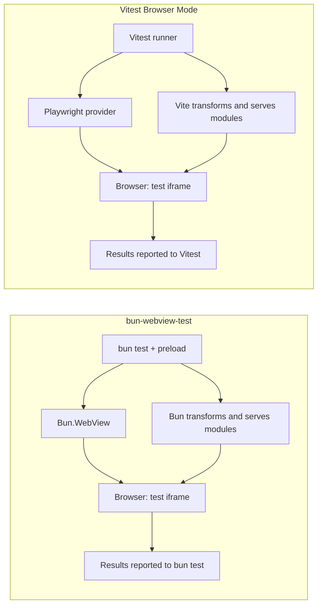

# bun-webview-test

[日本語](./README.ja.md)

**Browser tests for `bun test`.** A real browser (Chrome Headless Shell by default) runs inside your ordinary
`bun test` process through [`Bun.WebView`](https://bun.com/docs), with locators, `userEvent` and `expect.element`
modeled on [Vitest Browser Mode](https://vitest.dev/guide/browser/). No Playwright, no separate test runner, and
existing Vitest Browser Mode tests can run as they are.

> [!NOTE]
> Unofficial community package, not affiliated with Bun or Oven. See [About this package](#about-this-package).

> [!WARNING]
> `Bun.WebView` is experimental as of Bun 1.3.14, and so is this package. Expect breaking changes before 1.0.

## Quick start

You need Bun **1.3.14** or later and Chrome Headless Shell (see [Requirements](#requirements)).

1. Install:

   ```sh
   bun add -d bun-webview-test
   bunx bun-webview-test install
   ```

2. Register the preload in `bunfig.toml`:

   ```toml
   [test]
   preload = ["bun-webview-test/preload"]
   ```

3. Write something to render and a test for it:

   ```ts
   // src/counter.ts
   export default (root: HTMLElement, { initial }: { initial: number }) => {
     let count = initial;
     root.innerHTML = `<button>Increment</button><p role="status">count: ${count}</p>`;
     root.querySelector("button")!.addEventListener("click", () => {
       root.querySelector("[role=status]")!.textContent = `count: ${++count}`;
     });
   };
   ```

   ```ts
   // src/counter.test.ts
   import { expect, test } from "bun:test";
   import { page, userEvent } from "bun-webview-test";

   test("counter", async () => {
     await page.mount(new URL("./counter.ts", import.meta.url), { initial: 0 });

     await userEvent.click(page.getByRole("button", { name: "Increment" }));

     await expect.element(page.getByRole("status")).toHaveTextContent("count: 1");
   });
   ```

4. Run it:

   ```sh
   bun test
   ```

From here: [rendering things](#rendering-something), [locators](#locators), [`expect.element`](#expectelement),
[settings](#configuration), [CI](#running-in-ci), and
[running existing Vitest Browser Mode tests](#running-existing-vitest-browser-mode-tests).

## Requirements

- Bun **1.3.14** or later (`Bun.WebView` is required).
- **Chrome Headless Shell** is the default on macOS, Linux and Windows.
  Run `bunx bun-webview-test install` to download the pinned **145.0.7632.6** build directly from
  [Chrome for Testing](https://googlechromelabs.github.io/chrome-for-testing/). No Playwright packages,
  full Chrome, or FFmpeg are downloaded by this command. Complete cached downloads are reused.
- Extraction requires `unzip` on macOS/Linux or PowerShell on Windows. Linux also needs Chromium's
  system libraries (including NSS, X11, GBM and ALSA); the command does not install OS packages.
  The default build supports macOS arm64/x64, Linux x64 and Windows x64/x86. Linux arm64 needs a newer
  published build selected with `BWT_BROWSER_VERSION`, or a compatible executable via `BUN_CHROME_PATH`.

Both test APIs use the `chrome` backend with Shell to reduce overhead and keep the browser choice consistent across OSes.

### Downloading the browser

After adding the package to your project, run its included CLI:

```sh
bunx bun-webview-test install
```

The CLI ships with this package, so downloading the browser requires no Playwright or additional npm packages.
To use only the locally installed CLI, run `bunx --no-install bun-webview-test install`.
Browser installation is managed by the consuming project. Neither `bun install` nor test execution
performs an automatic download, and the browser is not bundled in the npm package.

The installer uses the OS cache directory under `bun-webview-test`, with a separate directory for each
version/platform. Set `BWT_BROWSERS_PATH` to choose another cache, such as one saved by CI.
Set `BWT_BROWSER_VERSION` to an exact four-part Chrome version to override the default; use the **same values
for installation and test execution**. In a custom cache or with an explicit version, a missing browser
is an error rather than a fallback to a different version.

```sh
BWT_BROWSERS_PATH=./.cache/bun-webview-test bunx bun-webview-test install
BWT_BROWSERS_PATH=./.cache/bun-webview-test bun test
```

An explicit `BUN_CHROME_PATH` takes priority. Otherwise, we use the pinned managed download, then fall back
to the newest installed Shell revision in Playwright's standard cache for existing users. An explicit
`PLAYWRIGHT_BROWSERS_PATH` selects that cache instead, unless `BWT_BROWSERS_PATH` or `BWT_BROWSER_VERSION` is also set.
Hermetic Playwright installs (`PLAYWRIGHT_BROWSERS_PATH=0`) require `BUN_CHROME_PATH`.

To use regular Chrome, set `BUN_CHROME_PATH` to its executable (`chromePath` also works with the native API).
On macOS, `BWT_BACKEND=webkit` opts into the system WKWebView without a browser download. WKWebView depends
on the OS's WebKit version and has Tab, hover, touch, History and CSS differences;
see [Backend compatibility](#backend-compatibility).

WKWebView is the macOS default for its low startup cost and zero browser installation; local scaling checks
with replicated tests also finished sooner than Chrome. It uses the OS's WebKit version and has limitations
around Tab, hover and touch, plus History and CSS differences. Use `BWT_BACKEND=chrome` when your tests need
those features or Chromium behavior; see [Backend compatibility](#backend-compatibility).

## Configuration

The preload adds `expect.element`, resets the page between tests, fails tests on uncaught page errors, and closes the
browser at the end.

To change settings, write your own preload and register it instead of `bun-webview-test/preload`:

```ts
// test/setup.ts  (and set preload = ["./test/setup.ts"] in bunfig.toml)
import { configure } from "bun-webview-test";
import "bun-webview-test/preload";

configure({ width: 375, height: 812, expectTimeout: 2000, publicDir: "./public" });
```

The browser starts the first time a test touches `page` and is shared by every test file (Chrome takes about a
second to start; resetting the page between tests takes tens of milliseconds). Tests that never touch `page`
pay nothing.

For many test files, use `bun test --parallel --no-isolate`. Each file runs in a fresh browser document, with fresh
DOM, globals, and module instances. Chrome reuses the tab within a worker, resetting the document, session storage,
history, and pointer between files. Files that use raw CDP or access a custom command's `view` dispose of the tab
instead. `--isolate` additionally resets Bun-side state such as `mock`. Cookies and local storage remain scoped to
the browser origin; this is not a fresh browser profile per file.

`bun test --parallel` (and `--isolate`) work too. Chrome is launched once per worker process and reused even when
the globals are recreated for each file; it stops when the process exits. Set `BWT_SHARED_CHROME=0` to turn this
reuse off.

### Settings

| Setting | Default | Description |
| --- | --- | --- |
| `backend` | `"chrome"` on every OS | Also settable with the `BWT_BACKEND` environment variable |
| `chromePath` | `BUN_CHROME_PATH`, managed Shell, or existing Playwright Shell | Explicit path can also select regular Chrome |
| `chromeArgs` | `["--no-sandbox"]` when running as root | Extra Chrome arguments |
| `width` / `height` | 1280 / 720 | Viewport size |
| `actionTimeout` | 3000 | How long actions such as `click` wait for the element (ms) |
| `expectTimeout` | 1000 | How long `expect.element` retries (ms) |
| `failOnPageError` | `true` | Fail the test on uncaught exceptions in the page |
| `resetBetweenTests` | `true` | Return to a blank page before each test |
| `forwardConsole` | `true` | Forward the page's `console.*` to Bun's console |
| `publicDir` | none | Directory served for `page.goto("/x.html")` |

## Rendering something

- `page.setContent(html)` shows an HTML string. If your renderer produces HTML, build the string in Bun and pass it
  straight in.
- `page.mount(entry, props)` bundles `entry` for the browser with `Bun.build` and calls its
  `export default (root, props) => void | cleanup`. CSS imported with `import "./x.css"` is loaded too. For React
  and friends, call `createRoot(root).render(...)` inside that function.
- `page.importModule<typeof import("./x")>(entry)` loads a module in the page; `mod.call("fn", ...args)` calls one
  of its exports there, with typed arguments and return value (values travel as JSON).
- `page.evaluate((a) => ..., a)` runs a function in the page. It is serialized to a string, so it cannot close over
  outer variables; pass values as arguments.
- `page.goto(url)`, `page.screenshot({ path })`, `page.setViewport(w, h)` and `page.view()` (the raw
  `Bun.WebView`) are also available.

## Locators

`page.getByRole`, `getByText`, `getByLabelText`, `getByPlaceholder`, `getByAltText`, `getByTitle`, `getByTestId`
and `locator(css)`, plus `nth`, `first`, `last` and `filter({ hasText, has })`. All of them chain.

A locator only describes how to find an element; it is resolved again inside the page for every action and
assertion. Acting on a locator that matches more than one element is an error (Playwright's strict mode); when it
matches nothing, the action waits for it to appear.

Actions: `click`, `dblclick`, `fill`, `clear`, `type`, `press`, `check`, `uncheck`, `selectOptions`, `focus`,
`scrollIntoView` and `hover` (Chrome only). Clicks and key presses use `Bun.WebView`'s native input, so events in the
page have `isTrusted: true`.

`userEvent` is a thin wrapper shaped like Vitest's, e.g. `userEvent.keyboard("abc{Enter}{Shift+Tab}")`.

## expect.element

The preload adds `expect.element` (and its types to `bun:test`). It retries until the condition holds, so there is
no need for explicit waits. Always `await` it.

`toBeInTheDocument`, `toBeVisible`, `toBeHidden`, `toHaveTextContent`, `toHaveValue`, `toHaveAttribute`,
`toHaveClass`, `toHaveStyle` (compared with `getComputedStyle`), `toBeChecked`, `toBePartiallyChecked`,
`toBeDisabled`, `toBeEnabled`, `toBeFocused`, `toHaveAccessibleName`, `toHaveRole`, `toHaveCount`, and `.not`.

## How it differs from Vitest Browser Mode

Vitest runs the test file itself in the browser. Here the test runs in Bun and drives the browser remotely, much like
Playwright component testing.

- Good: `bun test`'s `mock`, snapshots, file system access and so on work as usual. Only the code under test is
  bundled and sent to the browser.
- Watch out: test code cannot touch DOM elements directly. Use `page.evaluate` or `importModule().call()` to do
  things inside the page.

## Running existing Vitest Browser Mode tests

Add `bun-webview-test/vitest-preload` to the preload and any test file that imports `vitest/browser` (or is named
`*.browser.test.ts`) is no longer run by Bun. Instead it runs inside the page on Vitest's own runner
(`@vitest/runner`, `expect`, and `@vitest/browser`'s `page`, `userEvent`, locators and `expect.element`), and its
results are reported as `bun test` tests.

```toml
# bunfig.toml
[test]
preload = ["bun-webview-test/preload", "bun-webview-test/vitest-preload"]
```

For the types of `vitest/browser`, add `bun-webview-test/vitest-types` to `compilerOptions.types`:

```jsonc
// tsconfig.json
{
  "compilerOptions": {
    "types": ["bun", "bun-webview-test/vitest-types"]
  }
}
```

Instead of `vitest.config`, settings go in the `bwt.config.ts` closest to the test file. Its directory becomes the
`root`, and by default every test below it runs in the browser.

```ts
// bwt.config.ts
import { defineConfig } from "bun-webview-test/vitest";

export default defineConfig({
  setupFiles: ["./setup.ts"],
  viewport: { width: 414, height: 896 },
  actionTimeout: 500, // providers.playwright({ actionTimeout })
  locators: { errorFormat: "aria" },
  alias: { "#src": "./src" },
  optimizeDeps: { include: ["some-cjs-lib"] },
  commands: { myCommand: (ctx, arg) => arg },
  screenshotFailures: false,
});
```

Put JSON in the `BWT_CONFIG` environment variable to override settings like CLI flags, e.g.
`BWT_CONFIG='{"locators":{"errorFormat":"html"}}' bun test`.

### Backend compatibility

Set `BWT_BACKEND=chrome` or `BWT_BACKEND=webkit` when comparing results. WKWebView uses the macOS system
WebKit; it is a different build from Playwright WebKit. The following was checked with Bun 1.4.2,
macOS 26.6.2 and Chromium 145.0.7632.6; engine behavior may change with upgrades.

| Behavior | Chrome | WKWebView |
| --- | --- | --- |
| `focus()`, `:focus`, `document.hasFocus()` | Supported; focus emulation is enabled | Supported; the runner focuses the **iframe element** before loading setup files and tests, including Shadow DOM tests |
| `userEvent.tab()` | Native focus traversal | Bun 1.4.2's unmodified Tab does not traverse focus or emit `keydown`; use Chrome for keyboard navigation tests |
| `new TouchEvent(...)` | Constructor available | Constructor unavailable in the tested macOS build |
| `userEvent.hover()` / `unhover()` | Supported | Unsupported; throws an explicit Chrome-backend-required error |
| `history.pushState()` / `replaceState()` | No failure in the 101-update check | Shared limit of 100 updates per 10 seconds; the 101st `replaceState()` threw `SecurityError` |
| CSS URL serialization / layout dimensions | Browser serialization and rounding apply | Unquoted URLs may contain escapes; fractional layout results may differ |

**Focus and Tab are separate.** Focusing only the iframe's `contentWindow` can update `activeElement`
without activating `:focus`. The runner now focuses the iframe element before executing the file.
Tab still fails in a focused WKWebView, including between two inputs. A direct `Bun.WebView` reproduction
also fails: Bun routes unmodified Tab to the `InsertTab` editing command instead of the native key-event
path ([Bun 1.4.2 implementation](https://github.com/oven-sh/bun/blob/744846f844374847c902b5e7fd59b4342a51ef99/src/runtime/webview/WebViewHost.cpp#L494-L579)).
Changing macOS keyboard-navigation settings is not a verified workaround for this path. WebKit's choice
of tabbable elements is a separate issue; a skipped link alone does not diagnose the input-delivery problem.

**Touch:** run constructor and event-handler tests on Chrome, with a feature check if they must also run
on WKWebView. A polyfill or `dispatchEvent(new TouchEvent(...))` produces synthetic events; it does not
verify native touch input. This package does not provide a high-level native tap/touch-emulation API.

**History:** setup, test bodies and cleanup share the update budget. Reduce redundant navigation and
split large router suites into separate `.browser.test.ts` files: Vitest compatibility mode creates a new
WebView for each file. `document.body.innerHTML = ''` does not reset History, and even `view.reload()`
retained the exhausted budget in the direct WKWebView check. A fresh WebView reset it. Do not reload the
running Vitest tester iframe to reset state; that also restarts its test runtime. Chrome is an alternative
when WebKit's throttling is outside the behavior under test.

**CSS:** `url(regular.jpg)` may serialize as `url(regular\.jpg)` in WebKit. Prefer quoted URLs when
constructing custom properties, or compare the rendered result rather than searching serialized CSS
for an unescaped filename. For layout assertions, compare numeric dimensions with a tolerance that fits
the component instead of requiring identical pixel strings:

```ts
el.style.setProperty('--image', 'url("regular.jpg")');
expect(el.getBoundingClientRect().width).toBeCloseTo(100, 3);
```

Vitest results are registered with Bun after each browser test file finishes, so runtime skips and hook
failures are known before reporting. A todo remains a todo even in a suite with no runnable tests.

### What works like Vitest

Vitest 5.0.3's own `test/browser` suite (tests, fixtures and specs) is ported into this package and passes on the Chrome backend.

- Tests run in an iframe (sized to the viewport) on an orchestrator page, as in Vitest, so tests relying on
  `window.top` or `window.frameElement` work.
- Vite-like per-module serving with source maps, pre-bundling of `node_modules` (including CommonJS named exports),
  `import.meta.env` and `.env`, CSS / CSS Modules / JSON / `?raw` / `?url` / assets, aliases, `server.headers`, and
  the tester HTML (`testerHtmlPath`).
- Locators and `userEvent` (native input, `isTrusted: true`), `expect.element`, `toMatchScreenshot`,
  `page.screenshot`, `page.viewport`, `cdp()`, custom commands, and fs commands such as `readFile` (restricted like
  Vite's `server.fs.allow`).
- Snapshots: file, inline, `toMatchFileSnapshot` and ARIA snapshots.
- Action timeouts (explicit, then `actionTimeout`, then what is left of the test or hook), and test timeouts that
  name the action being waited on.
- Error stacks mapped back to original files (including dependencies' original sources), screenshots on failure,
  the "which test was running" explanation of unhandled errors, `trackUnhandledErrors` and `onUnhandledError`.

### Not supported

- **Module mocking (`vi.mock`, `vi.doMock`, `vi.hoisted` and friends) is intentionally not supported.** Export the
  functions you want to replace as methods of an object and replace them with `vi.spyOn` inside browser tests, or
  with `mock` / `spyOn` from `bun:test` in Bun-side tests:

  ```ts
  // calculator.ts
  export const calculator = { add: (a: number, b: number) => a + b };

  // calculator.browser.test.ts
  import { expect, test, vi } from "vitest";
  import { calculator } from "./calculator";

  test("spy", () => {
    vi.spyOn(calculator, "add").mockReturnValue(42);
    expect(calculator.add(1, 2)).toBe(42);
  });
  ```

- Tracing (`trace`) is not supported.
- A failing `beforeAll` is reported as a failure of the first test in its suite, and a failing `afterAll` as the
  suite's `afterAll` (Vitest reports both as suite failures).
- Unhandled errors are reported as an `(unnamed)` failure at the end of the file.

## Running in CI

On GitHub Actions' Ubuntu 24.04 runners, Chrome's sandbox is blocked by AppArmor unless you lift the restriction on
unprivileged user namespaces:

```yaml
- uses: oven-sh/setup-bun@v2
- run: bun install --frozen-lockfile
- run: sudo sysctl -w kernel.apparmor_restrict_unprivileged_userns=0
- run: bunx bun-webview-test install
  env:
    BWT_BROWSERS_PATH: ${{ github.workspace }}/.cache/bun-webview-test
- run: bun test
  env:
    BWT_BROWSERS_PATH: ${{ github.workspace }}/.cache/bun-webview-test
```

These Ubuntu runners already include Chromium system libraries and `unzip`; minimal containers must install them separately.

When running as root (for example in Docker), `--no-sandbox` is added automatically.

The browser is launched by the first test that touches `page`, and that launch counts against the test's timeout.
On a cold CI runner Chrome can take several seconds to start, so start it in a `beforeAll` with a longer timeout:

```ts
import { beforeAll } from "bun:test";
import { getSession } from "bun-webview-test";

beforeAll(() => getSession(), 30_000);
```

## Compared with Vitest Browser Mode

This comparison uses Vitest with `@vitest/browser-playwright` and Chromium. Other providers and browsers have different characteristics.

| Aspect | bun-webview-test | Vitest Browser Mode / Playwright |
| --- | --- | --- |
| Test runner | `bun test`; results appear in Bun's runner | Vitest; results appear in Vitest's runner |
| Module transformation and serving | Bun build APIs and an HTTP server built with `Bun.serve` | Vite dev server and its plugin pipeline |
| Browser control | `Bun.WebView`, with Chrome Headless Shell by default | Playwright provider; Chromium can also use Headless Shell |
| Browser download | Included `bun-webview-test install` CLI; fixed Shell build only | Playwright CLI; `--only-shell` can omit full Chromium |
| Integration | Bun workflow and a Vitest-compatible API; see [supported features](#what-works-like-vitest) and [limitations](#not-supported) | Vite configuration/plugins and Playwright's Chromium, Firefox and WebKit support |

See the official [Vitest Browser Mode guide](https://vitest.dev/guide/browser/) and [Playwright browser installation guide](https://playwright.dev/docs/browsers) for the compared configuration.

### Execution flow

For existing Vitest-style tests, both systems execute test code in a real browser. The host runner, module server and browser-control layer differ:



This diagram describes responsibilities, not one OS process per box. Chromium still uses multiple processes.
With the native `bun-webview-test` API, test functions run in Bun and operate on the browser through `page`;
the diagram describes the Vitest-compatible API. With `--no-isolate`, eligible Chrome tabs are reused within a worker,
while each file gets a fresh document. See [configuration](#configuration) for isolation details.

### Download and installed size

In isolated macOS arm64 projects installed with Bun 1.4.2, the npm files occupied **47.9 MB** for this working
package and its dependencies, versus **50.0 MB** for Vitest 5.0.3, `@vitest/browser-playwright` 5.0.3 and Playwright 1.56.1.
These are logical file sizes under `node_modules`, excluding symlinks, browsers, runtimes and package-manager caches;
they are not compressed download sizes or filesystem block usage. The saving in this snapshot is modest.
This package still depends on `vitest` and `@vitest/browser`, and Vite is installed transitively; avoiding their host
pipeline at runtime does not remove those npm dependencies. See [size data and measurement method](bench/vitest-browser/README.md#installation-size).

Browser downloads are separate. Official Chrome for Testing **145.0.7632.6** ZIP sizes (decimal MB):

| Platform | Headless Shell | Full Chrome |
| --- | ---: | ---: |
| macOS arm64 | 95.5 MB | 170.2 MB |
| Linux x64 | 116.3 MB | 175.4 MB |
| Windows x64 | 114.1 MB | 181.2 MB |

These compare browser artifacts, not the two test runners. Using the same Shell artifact gives both runners the
same browser footprint. Our installer fetches only Shell; Playwright can also omit full Chromium with
[`--only-shell`](https://playwright.dev/docs/browsers#chromium-headless-shell). Do not treat the Shell-versus-Chrome
saving as an inherent advantage over Vitest. [Exact archive sizes and URLs](bench/vitest-browser/browser-download-sizes.json)
are recorded separately; extracted browser sizes are not measured here.

## Performance

The [Browser benchmark workflow](.github/workflows/benchmark.yml) compares both runners on Ubuntu for relevant PRs
and pushes to `main`, and can also be started from Actions with **Run workflow**. It uses the same pinned Shell,
100 files / 800 tests, two workers, one warmup and three measured runs. Results appear in the job summary;
raw samples, runtime versions, dependency lockfile and logs are retained as artifacts for 30 days, including
available logs on failure. Timing differences do not fail CI; test failures or incomplete runs do.
This workflow measures elapsed time; memory and install-size measurements are separate. See [CI benchmark details](bench/vitest-browser/README.md#ci-benchmark).

On an Apple M2 Pro (macOS 26.6.2, Bun 1.4.2, Node 26.3.0), the 100-file / 800-test scaling workload
completed **26.5% sooner than Vitest with Chrome Headless Shell**, or **11.6% sooner with regular Chrome in headless mode**.
Each pair uses the same Chromium 145.0.7632.6 executable and four workers. Medians of three runs after one warmup,
including process startup and exit; bun-webview-test uses `--parallel=4 --no-isolate`.

| Browser executable | bun-webview-test | Vitest 5.0.3 / Playwright 1.56.1 |
| --- | ---: | ---: |
| Chrome Headless Shell | **3.93s** | 5.35s |
| Regular Chrome, headless | **8.14s** | 9.21s |
| WKWebView | 8.14s | — |

The workload repeats five existing test files twenty times, including 100 screenshots; it measures file-count scaling,
not 800 distinct test cases. Regular Chrome previously took 14.90s. Tab reuse, one document reset per file, immutable
runtime caching, and avoiding duplicate paint waits before Chrome screenshots reduce overhead. Raw CDP and custom
`view` access bypass tab reuse. This is one machine and workload, not a guarantee for every suite or OS. Memory was
not measured. See [reproduction and samples](bench/vitest-browser/README.md#file-count-scaling).

Headless Shell is selected automatically after installation. To pin an exact executable:

```sh
BWT_BACKEND=chrome BUN_CHROME_PATH=/absolute/path/to/chrome-headless-shell bun test --parallel=4 --no-isolate
```

[Headless Shell is a separate browser implementation](https://developer.chrome.com/docs/automation-and-testing/headless#use-old-headless-mode),
with behavior differences from regular Chrome. Pin the same executable type and version in development and CI;
use regular Chrome when fidelity to the full browser matters. Shell and regular Chrome can differ in screenshots, PDF viewing, extensions and GPU/WebGL behavior.
For image comparisons, also pin the OS and fonts.

### Earlier Linux measurement

An earlier measurement compared Vitest 5.0.3 Browser Mode (`@vitest/browser-playwright`) on the same 4-core machine with the same
headless Chromium binary, running the ported `test/browser/test` suite (21 files, 127 tests). Wall time from process
start to exit, median of 5 warm runs. The scripts are in
[`bench/vitest-browser`](bench/vitest-browser).

| | Time |
| --- | --- |
| bun-webview-test, `bun test --parallel --no-isolate` (recommended) | **5.0s** |
| bun-webview-test, `bun test --parallel` | 5.5s |
| bun-webview-test, `bun test` (one file at a time) | 7.5s |
| Vitest (default, files in parallel) | 6.3s |
| Vitest (`--no-file-parallelism`) | 7.6s |

### Memory efficiency

The following figures come from the earlier Linux benchmark, using the same regular Chromium binary.
Peak memory is process-tree PSS including Chromium, sampled every 50 ms; shared pages are proportionally counted.
Values are MiB (the benchmark script labels them MB). Startup uses a single test; cold runs first clear `.vite` / `.bwt` caches.

| | Time (cold / warm) | Peak memory |
| --- | --- | --- |
| bun-webview-test | 0.53s / 0.53s | 329 MiB |
| Vitest | 2.42s / 2.00s | 788 / 567 MiB (cold / warm) |

| Serial suite, 21 files / 127 tests | Peak process-tree PSS |
| --- | ---: |
| bun-webview-test | 382 MiB |
| Vitest | 770 MiB |

In that earlier workload, `--parallel --no-isolate` reduced suite time by about 20% and startup time by about 75%.
Serial suite peak memory was about 50% lower. This does not establish the memory cost of the current Shell default,
the macOS scaling workload, or WKWebView; those remain unmeasured. Worker count and test content affect memory usage.

## About this package

This is an unofficial, community package. It is not affiliated with Bun or Oven.

bun-webview-test exists only because `bun test` has no browser mode yet, and the hope is that Bun itself will
support browser testing natively so that this package can be retired. If Bun ships something equivalent, please use
that instead. Requests for a browser mode in Bun belong in [Bun's issue tracker](https://github.com/oven-sh/bun/issues),
not here; the author of this package is not on the Bun team and cannot act on them.

## Contributing

```sh
bun install
bun src/cli.ts install # download Headless Shell using this checkout's CLI
bun test
bun run typecheck
bun run build       # type declarations into dist/
bun run lint:package
```

Changes that affect users need a changeset (`bun run changeset`). See [RELEASING.md](./RELEASING.md) for how
releases are published.

## License

[MIT](./LICENSE). Parts are adapted from Vitest (MIT) and Playwright (Apache-2.0); see
[THIRD_PARTY_NOTICES.md](./THIRD_PARTY_NOTICES.md).
